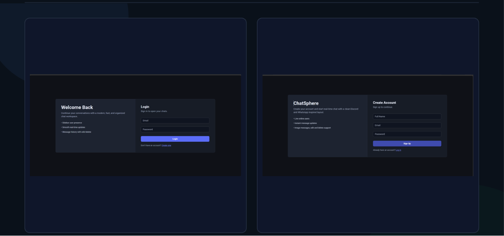
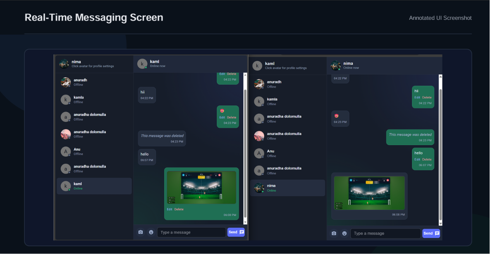
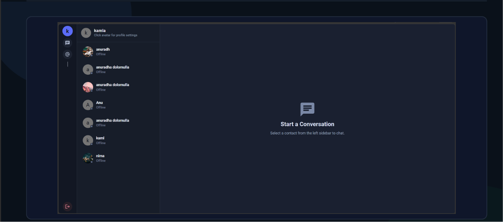
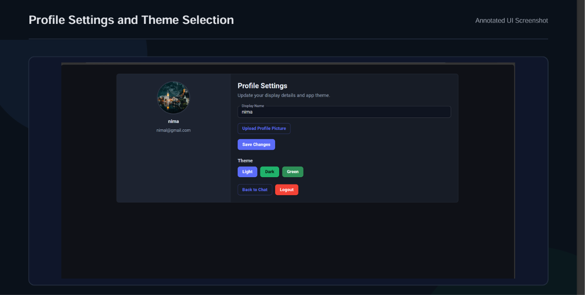

# ChatSphere - MERN Real-Time Chat App

ChatSphere is a full-stack real-time chat application I built with the MERN stack. The main goal of this project was to make a clean messaging experience with authentication, live online status, image messages, profile updates, and real-time message changes using Socket.IO.

I kept the app simple to run, but the internal structure is separated properly: the backend handles API routes, authentication, database models, Cloudinary uploads, and Socket.IO events, while the frontend handles the chat dashboard, auth screens, profile page, themes, and API communication.

## Project Report

I added a more detailed project document with screenshots, architecture notes, feature explanation, and the technical flow I used:

[Open the professional PDF report](docs/project-documentation.pdf)

Screenshot assets are also stored in [docs/screenshots](docs/screenshots).

## What I Used

- MongoDB and Mongoose for storing users and messages
- Express.js and Node.js for the backend REST API
- React with Vite for the frontend
- Material UI for the main UI components and theme setup
- Socket.IO for real-time online users and message updates
- JWT with HTTP-only cookies for authentication
- bcryptjs for password hashing
- Cloudinary for profile pictures and chat image uploads
- Multer for handling profile image upload data
- Axios for frontend API requests

## Main Features

- User signup, login, logout, and auth check
- Password hashing before saving user accounts
- JWT token stored in an HTTP-only cookie
- Protected backend routes for profile and message APIs
- Real-time online/offline user status
- One-to-one chat conversation view
- Send text messages and image messages
- Edit and soft-delete own messages
- Profile name and profile picture update
- Theme selection from the profile page
- Responsive dashboard layout with a sidebar and chat panel

## Folder Structure

```text
mern-chat-app-jwt-socketio/
|-- backend/
|   |-- src/
|   |   |-- config/
|   |   |-- controllers/
|   |   |-- middleware/
|   |   |-- models/
|   |   |-- routes/
|   |   |-- utils/
|   |   `-- index.js
|   |-- .env.example
|   `-- package.json
|-- frontend/
|   `-- ui/
|       |-- src/
|       |   |-- api/
|       |   |-- app/
|       |   |-- constants/
|       |   |-- pages/
|       |   `-- theme/
|       |-- .env.example
|       `-- package.json
|-- docs/
|   |-- screenshots/
|   `-- project-documentation.pdf
|-- .gitignore
|-- package.json
`-- README.md
```

This structure keeps backend, frontend, and documentation separate. I also added root-level npm scripts so the project can be managed from the main folder without remembering every nested command.

## How the Real-Time Flow Works

After a user is authenticated, the frontend connects to the Socket.IO server with the current user id. The backend stores the active socket id and emits the online users list to all connected clients.

For the main chat flow, the frontend sends messages through the protected REST endpoint. The backend saves the message in MongoDB and then emits Socket.IO events to both chat participants. That gives the app persistent message history and live updates at the same time.

The same event-based approach is used for edit and delete actions:

- `newMessage` updates the active conversation instantly
- `messageUpdated` replaces edited message content in the UI
- `messageDeleted` marks the message as deleted without removing the database record
- `getOnlineUsers` keeps the sidebar presence state updated

## Environment Setup

Create a backend environment file:

```bash
cp backend/.env.example backend/.env
```

Create a frontend environment file if you want to override the defaults:

```bash
cp frontend/ui/.env.example frontend/ui/.env
```

Backend variables:

```text
MONGODB_URI=your-mongodb-connection-string
PORT=3000
JWT_SECRET=your-secret-key
NODE_ENV=development
CLIENT_ORIGINS=http://localhost:5173,http://localhost:5174
CLOUDINARY_CLOUD_NAME=your-cloudinary-cloud-name
CLOUDINARY_API_KEY=your-cloudinary-api-key
CLOUDINARY_API_SECRET=your-cloudinary-api-secret
```

Frontend variables:

```text
VITE_API_BASE_URL=http://localhost:3000
VITE_SOCKET_URL=http://localhost:3000
```

## Run Locally

Install both backend and frontend dependencies:

```bash
npm run install:all
```

Start the backend:

```bash
npm run dev:backend
```

Start the frontend in another terminal:

```bash
npm run dev:frontend
```

Default local URLs:

- Backend API: `http://localhost:3000`
- Frontend UI: `http://localhost:5173`

## Useful Commands

```bash
npm run dev:backend
npm run dev:frontend
npm run start:backend
npm run build:frontend
npm run lint:frontend
```

## Screenshots

| Auth Screens | Chat Dashboard |
| --- | --- |
|  |  |

| Empty Chat State | Profile Settings |
| --- | --- |
|  |  |

## Notes

I added `.env.example` files for both sides because the real `.env` file should stay local. The app needs MongoDB and Cloudinary credentials to use every feature fully, especially image uploads and profile pictures.
